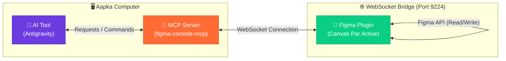
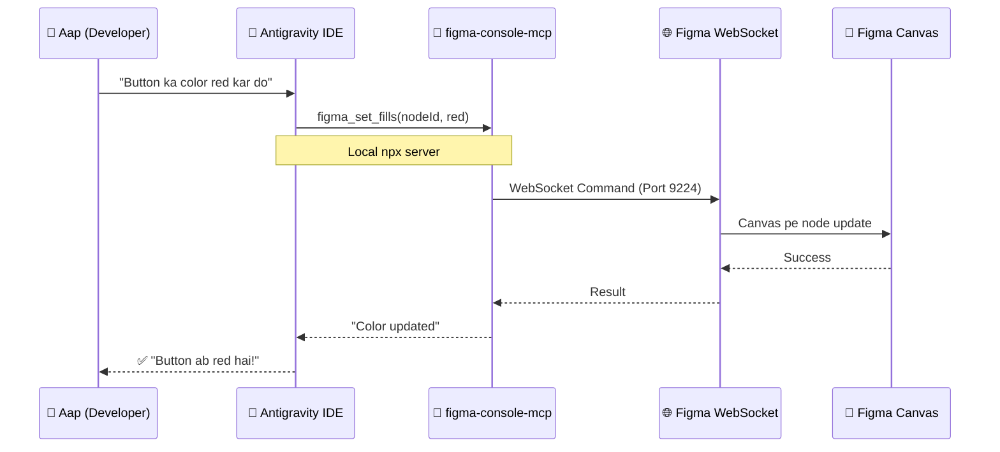

# 🎨 Figma Console MCP — Mukammal Guide (Roman Urdu)

> [!NOTE]
> Yeh guide Roman Urdu mein likhi gayi hai. Is mein hum seekhein ge ke **Figma Console MCP** ko Antigravity se kaise connect karein taake hum **Read aur Write** dono operations perform kar sakein.

---

## 📚 Table of Contents

1. [Figma Console MCP Kya Hai?](#-figma-console-mcp-kya-hai)
2. [Connection Ke Steps — Pehli Baar](#-connection-ke-steps--pehli-baar-first-time-setup)
3. [Configuration File (`mcp_config.json`)](#-configuration-file)
4. [Environment Variables Export Karna](#-environment-variables-export-karna)
5. [Architecture Diagram — WebSocket Bridge](#-architecture-diagram--websocket-bridge)
6. [Tools aur Commands](#-tools-aur-commands)
7. [Troubleshooting](#-troubleshooting)

---

## 🧠 Figma Console MCP Kya Hai?

Figma Console MCP ek powerful server hai jo **WebSocket Bridge** ke zariye aapke local IDE (jaise Antigravity) ko Figma ke canvas se jor deta hai. 
Iska sab se bara faida yeh hai ke yeh **OAuth browser login ke baghair** aapke **Personal Access Token** ko use kar ke aapko Figma canvas par **Read aur Write (Design modify karna, text change karna, color badalna)** dono ki permission deta hai.



---

## 🔧 Connection Ke Steps — Pehli Baar (First Time Setup)

Figma Console MCP ko successfully connect karne ke liye yeh steps follow karein:

### Step 1️⃣ — Personal Access Token Generate Karo
1. Figma kholein → **Account Menu** (upar left corner)
2. **Settings** → **Security** tab par jao
3. **Personal access tokens** section mein **"Generate new token"** click karein
4. Scopes mein **File content (Read)** select karein aur token copy kar lein.

### Step 2️⃣ — Environment Variables Set Karein
Terminal mein apne token aur MCP apps flag ko export karein taake server usay use kar sake:

```bash
export FIGMA_ACCESS_TOKEN="aapka_figma_token_yahan"
export ENABLE_MCP_APPS=true
```

> [!TIP]
> Aap in commands ko apni `~/.bashrc` ya `~/.zshrc` file mein bhi daal sakte hain taake baar baar likhna na pare.

### Step 3️⃣ — MCP Config File Update Karein
Apne Antigravity ki config file (`~/.gemini/config/mcp_config.json`) ko update karein:

```json
{
  "mcpServers": {
    "figma-console": {
      "command": "npx",
      "args": [
        "-y",
        "figma-console-mcp@latest"
      ],
      "env": {
        "FIGMA_ACCESS_TOKEN": "aapka_figma_token_yahan",
        "ENABLE_MCP_APPS": "true"
      }
    }
  }
}
```

### Step 4️⃣ — Figma Mein Plugin Open Karein (WebSocket Bridge)
Figma Console MCP tabhi theek se kaam karta hai jab Figma canvas par ek connection (WebSocket) available ho. Jab aap Antigravity restart karenge, toh server start hoga aur port `9223` ya `9224` par listen karega.

### Step 5️⃣ — IDE Restart Karein
Antigravity ko reload karein. Server automatically start hoga aur Figma se connect ho jayega.

---

## 🏗️ Architecture Diagram — WebSocket Bridge



---

## 🛠️ Tools aur Commands

`figma-console-mcp` ke paas **100+ tools** available hain, jin mein se kuch ahem yeh hain:

| Tool Name | Kya Karta Hai? | Capability |
|---|---|---|
| `figma_get_status` | Connection check karta hai aur page details deta hai | 📖 Read |
| `figma_take_screenshot` | Canvas ya specific node ka screenshot nikalta hai | 📖 Read |
| `figma_set_fills` | Kisi bhi shape ya text ka color/opacity badalta hai | ✏️ Write |
| `figma_set_text` | Text layer ka content aur font styles badalta hai | ✏️ Write |
| `figma_execute` | Custom JavaScript/Figma API code seedha run karta hai | ✏️ Write |

---

## 💡 Troubleshooting — Common Masail

| Error | Wajah | Hal |
|---|---|---|
| `Unauthorized` ya `Invalid Token` | Token galat hai ya ENV mein set nahi hai | `export FIGMA_ACCESS_TOKEN="..."` command dobara chalayen aur config check karein |
| `Connection Refused` | WebSocket connect nahi ho raha | IDE restart karein aur ensure karein ke `ENABLE_MCP_APPS=true` set hai |
| `Node not found` | Aapne galat node ID di hai | Pehle `figma_take_screenshot` se node confirm karein |

---

> [!IMPORTANT]
> **Figma Developer MCP vs Figma Console MCP**: Puraane `figma-developer-mcp` mein sirf Read permissions thein (sirf data dekhna). Naye `figma-console-mcp` mein **Read aur Write dono hain**, matlab ab AI aapke design ko practically change kar sakta hai bina kisi complex OAuth flow ke! 🚀

---

*📅 Last Updated: 9 August 2026*
*🖊️ Created by: Antigravity AI Assistant*
