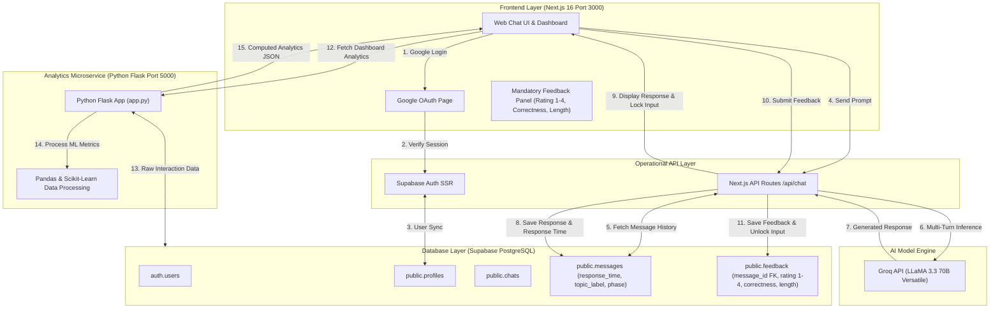

# Technical Specifications: Multi-Turn AI Chatbot with LLaMA 3

## 📝 Summary

The **Multi-Turn AI Chatbot System** is a session-based conversational platform engineered using **LLaMA 3.3 70B** (via Groq API), **Next.js 16**, **Supabase (PostgreSQL)**, and a dedicated **Python Flask Analytics Microservice**. 

The system enables users to engage in continuous, multi-domain AI conversations while enforcing a mandatory per-response 3-point feedback loop (Rating 1-4, Correctness, Length Type) and generating real-time performance analytics across topics, model response times, and dynamic session phases (Start, Middle, End).

---

## 📖 Background

### Project Overview
The project addresses the need for robust multi-turn conversational AI paired with fine-grained response quality monitoring. In standard AI chat interfaces, user feedback is often optional or uncollected, making it difficult to evaluate model performance across conversational progression.

### Purpose & Scope
- **Phase 1**: Frontend Next.js setup, Python Flask server initialization, Supabase connection, Groq API integration for LLaMA 3.3 70B, Google OAuth setup.
- **Phase 2**: Session creation/management, multi-turn context memory (re-sending full chat history), response time tracking (Float in seconds), mandatory per-response feedback (Rating 1-4, Correctness, Length Type), and input locking until feedback submission.
- **Phase 3**: Dynamic session phase segmentation (`start`, `middle`, `end`), domain classification (Machine Learning, Deep Learning, Healthcare AI, Power Systems, E-commerce AI), and graphical analytics dashboard display.

---

## ✅ Requirements & Use Cases

### Functional Requirements (FR1 - FR22)
1. **Authentication (FR2, FR6)**: Users must log in via Google OAuth 2.0 or email before accessing any chat session or dashboard.
2. **Session Management (FR7, FR8)**: System creates unique session IDs, maintains multi-turn conversation memory, and automatically generates summarized sidebar titles based on the user's first query.
3. **Model Inference (FR4, FR9)**: User prompts are processed via Groq API using `llama-3.3-70b-versatile` with full turn-level response display.
4. **Response Time Tracking (FR10)**: System records exact request and completion timestamps, storing `response_time` (Float in seconds) per assistant message.
5. **Mandatory Feedback & Input Control (FR12, FR13)**: 
   - Input box and send button freeze/lock immediately when an assistant response finishes.
   - User must submit mandatory 3-field feedback: Rating (1-4), Correctness (`correct`, `partial`, `Incorrect`), and Length Type (`short`, `To the point`, `lengthy`).
   - Text input unlocks immediately upon feedback submission.
6. **Analytics & Segmentation (FR14 - FR21)**:
   - Dynamic session phase calculation (Start ~33%, Middle ~34%, End ~33%).
   - Python Flask microservice calculates analytics metrics using `pandas` and `scikit-learn`.
   - Graphical visual charts (Topic Distribution, Accuracy vs Phase, Rating Distribution, Response Time Trend, Length Preference).

---

## 🏛️ Architecture and Design

---

## 🔗 Referenced Architecture Decision Records (ADRs)

- **ADR-0001**: Hybrid Dual-Backend Architecture (Next.js 16 + Exposed Python Flask REST API).
- **ADR-0002**: Groq API LLaMA 3.3 70B Model Integration.
- **ADR-0003**: Supabase Relational Database Schema Aligned with Project ERD.
- **ADR-0004**: Mandatory Per-Response Feedback Collection & Input Control Mechanism.
- **ADR-0005**: Dynamic Session Segmentation & Full Multi-Turn Context Management.
- **ADR-0006**: Tech Stack Migration to Next.js 16 (App Router + TypeScript).
- **ADR-0007**: Context Window Token Limits & Future History Truncation Strategy.
- **ADR-0008**: Google OAuth 2.0 User Authentication & Profile Synchronization.
